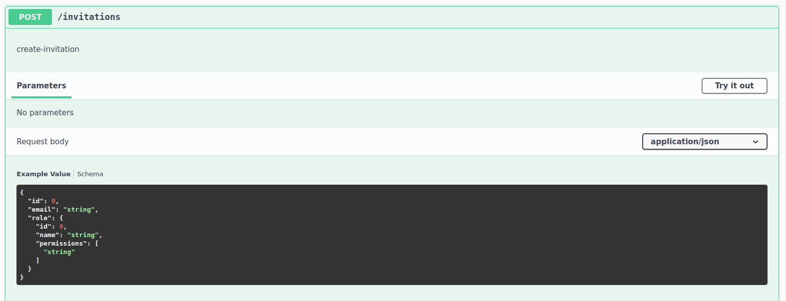

# springdoc-datarest-entity-refs

## OpenAPI Definition
```
openapi: 3.0.1
info:
  title: OpenAPI definition
  version: v0
servers:
- url: http://localhost:8080
  description: Generated server url
paths:
  /invitations:
    get:
      tags:
      - invitation-entity-controller
      description: get-invitation
      operationId: getCollectionResource-invitation-get_1
      responses:
        "200":
          description: OK
          content:
            application/hal+json:
              schema:
                $ref: '#/components/schemas/CollectionModelInvitation'
            application/x-spring-data-compact+json:
              schema:
                $ref: '#/components/schemas/CollectionModelInvitation'
            text/uri-list:
              schema:
                $ref: '#/components/schemas/CollectionModelInvitation'
    post:
      tags:
      - invitation-entity-controller
      description: create-invitation
      operationId: postCollectionResource-invitation-post
      requestBody:
        content:
          application/json:
            schema:
              $ref: '#/components/schemas/Invitation'
      responses:
        "201":
          description: Created
          content:
            application/hal+json:
              schema:
                $ref: '#/components/schemas/RepresentationModelInvitation'
  /invitations/{id}:
    get:
      tags:
      - invitation-entity-controller
      description: get-invitation
      operationId: getItemResource-invitation-get
      parameters:
      - name: id
        in: path
        required: true
        schema:
          type: string
      responses:
        "200":
          description: OK
          content:
            application/hal+json:
              schema:
                $ref: '#/components/schemas/EntityModelInvitation'
        "404":
          description: Not Found
    put:
      tags:
      - invitation-entity-controller
      description: update-invitation
      operationId: putItemResource-invitation-put
      parameters:
      - name: id
        in: path
        required: true
        schema:
          type: string
      requestBody:
        content:
          application/json:
            schema:
              $ref: '#/components/schemas/Invitation'
      responses:
        "200":
          description: OK
          content:
            application/hal+json:
              schema:
                $ref: '#/components/schemas/RepresentationModelInvitation'
        "201":
          description: Created
          content:
            application/hal+json:
              schema:
                $ref: '#/components/schemas/RepresentationModelInvitation'
        "204":
          description: No Content
    delete:
      tags:
      - invitation-entity-controller
      description: delete-invitation
      operationId: deleteItemResource-invitation-delete
      parameters:
      - name: id
        in: path
        required: true
        schema:
          type: string
      responses:
        "204":
          description: No Content
        "404":
          description: Not Found
    patch:
      tags:
      - invitation-entity-controller
      description: patch-invitation
      operationId: patchItemResource-invitation-patch
      parameters:
      - name: id
        in: path
        required: true
        schema:
          type: string
      requestBody:
        content:
          application/json:
            schema:
              $ref: '#/components/schemas/Invitation'
      responses:
        "200":
          description: OK
          content:
            application/hal+json:
              schema:
                $ref: '#/components/schemas/RepresentationModelInvitation'
        "204":
          description: No Content
  /invitations/{id}/role:
    get:
      tags:
      - invitation-property-reference-controller
      description: get-invitation
      operationId: followPropertyReference-invitation-get_1
      parameters:
      - name: id
        in: path
        required: true
        schema:
          type: string
      responses:
        "200":
          description: OK
          content:
            application/hal+json:
              schema:
                $ref: '#/components/schemas/RepresentationModelInvitation'
            text/uri-list:
              schema:
                $ref: '#/components/schemas/RepresentationModelInvitation'
        "404":
          description: Not Found
    put:
      tags:
      - invitation-property-reference-controller
      description: update-invitation
      operationId: createPropertyReference-invitation-put
      parameters:
      - name: id
        in: path
        required: true
        schema:
          type: string
      requestBody:
        content:
          application/json:
            schema:
              $ref: '#/components/schemas/CollectionModelObject'
          application/x-spring-data-compact+json:
            schema:
              $ref: '#/components/schemas/CollectionModelObject'
          text/uri-list:
            schema:
              $ref: '#/components/schemas/CollectionModelObject'
      responses:
        "200":
          description: OK
          content:
            application/hal+json:
              schema:
                $ref: '#/components/schemas/RepresentationModelInvitation'
        "201":
          description: Created
          content:
            application/hal+json:
              schema:
                $ref: '#/components/schemas/RepresentationModelInvitation'
        "204":
          description: No Content
    delete:
      tags:
      - invitation-property-reference-controller
      description: delete-invitation
      operationId: deletePropertyReference-invitation-delete
      parameters:
      - name: id
        in: path
        required: true
        schema:
          type: string
      responses:
        "204":
          description: No Content
        "404":
          description: Not Found
    patch:
      tags:
      - invitation-property-reference-controller
      description: patch-invitation
      operationId: createPropertyReference-invitation-patch
      parameters:
      - name: id
        in: path
        required: true
        schema:
          type: string
      requestBody:
        content:
          application/json:
            schema:
              $ref: '#/components/schemas/CollectionModelObject'
          application/x-spring-data-compact+json:
            schema:
              $ref: '#/components/schemas/CollectionModelObject'
          text/uri-list:
            schema:
              $ref: '#/components/schemas/CollectionModelObject'
      responses:
        "200":
          description: OK
          content:
            application/hal+json:
              schema:
                $ref: '#/components/schemas/RepresentationModelInvitation'
        "204":
          description: No Content
  /invitations/{id}/role/{propertyId}:
    get:
      tags:
      - invitation-property-reference-controller
      description: get-invitation
      operationId: followPropertyReference-invitation-get
      parameters:
      - name: id
        in: path
        required: true
        schema:
          type: string
      - name: propertyId
        in: path
        required: true
        schema:
          type: string
      responses:
        "200":
          description: OK
          content:
            application/hal+json:
              schema:
                $ref: '#/components/schemas/RepresentationModelInvitation'
        "404":
          description: Not Found
    delete:
      tags:
      - invitation-property-reference-controller
      description: delete-invitation
      operationId: deletePropertyReferenceId-invitation-delete
      parameters:
      - name: id
        in: path
        required: true
        schema:
          type: string
      - name: propertyId
        in: path
        required: true
        schema:
          type: string
      responses:
        "204":
          description: No Content
        "404":
          description: Not Found
  /profile:
    get:
      tags:
      - profile-controller
      operationId: listAllFormsOfMetadata_1
      responses:
        "200":
          description: OK
          content:
            application/hal+json:
              schema:
                $ref: '#/components/schemas/RepresentationModelObject'
  /profile/invitations:
    get:
      tags:
      - profile-controller
      operationId: descriptor_1
      responses:
        "200":
          description: OK
          content:
            '*/*':
              schema:
                type: string
            application/alps+json:
              schema:
                type: string
            application/schema+json:
              schema:
                $ref: '#/components/schemas/JsonSchema'
  /profile/roles:
    get:
      tags:
      - profile-controller
      operationId: descriptor_2
      responses:
        "200":
          description: OK
          content:
            '*/*':
              schema:
                type: string
            application/alps+json:
              schema:
                type: string
            application/schema+json:
              schema:
                $ref: '#/components/schemas/JsonSchema'
  /roles:
    get:
      tags:
      - role-entity-controller
      description: get-role
      operationId: getCollectionResource-role-get_1
      responses:
        "200":
          description: OK
          content:
            application/hal+json:
              schema:
                $ref: '#/components/schemas/CollectionModelRole'
            application/x-spring-data-compact+json:
              schema:
                $ref: '#/components/schemas/CollectionModelRole'
            text/uri-list:
              schema:
                $ref: '#/components/schemas/CollectionModelRole'
    post:
      tags:
      - role-entity-controller
      description: create-role
      operationId: postCollectionResource-role-post
      requestBody:
        content:
          application/json:
            schema:
              $ref: '#/components/schemas/Role'
      responses:
        "201":
          description: Created
          content:
            application/hal+json:
              schema:
                $ref: '#/components/schemas/RepresentationModelRole'
  /roles/{id}:
    get:
      tags:
      - role-entity-controller
      description: get-role
      operationId: getItemResource-role-get
      parameters:
      - name: id
        in: path
        required: true
        schema:
          type: string
      responses:
        "200":
          description: OK
          content:
            application/hal+json:
              schema:
                $ref: '#/components/schemas/EntityModelRole'
        "404":
          description: Not Found
    put:
      tags:
      - role-entity-controller
      description: update-role
      operationId: putItemResource-role-put
      parameters:
      - name: id
        in: path
        required: true
        schema:
          type: string
      requestBody:
        content:
          application/json:
            schema:
              $ref: '#/components/schemas/Role'
      responses:
        "200":
          description: OK
          content:
            application/hal+json:
              schema:
                $ref: '#/components/schemas/RepresentationModelRole'
        "201":
          description: Created
          content:
            application/hal+json:
              schema:
                $ref: '#/components/schemas/RepresentationModelRole'
        "204":
          description: No Content
    delete:
      tags:
      - role-entity-controller
      description: delete-role
      operationId: deleteItemResource-role-delete
      parameters:
      - name: id
        in: path
        required: true
        schema:
          type: string
      responses:
        "204":
          description: No Content
        "404":
          description: Not Found
    patch:
      tags:
      - role-entity-controller
      description: patch-role
      operationId: patchItemResource-role-patch
      parameters:
      - name: id
        in: path
        required: true
        schema:
          type: string
      requestBody:
        content:
          application/json:
            schema:
              $ref: '#/components/schemas/Role'
      responses:
        "200":
          description: OK
          content:
            application/hal+json:
              schema:
                $ref: '#/components/schemas/RepresentationModelRole'
        "204":
          description: No Content
components:
  schemas:
    AbstractJsonSchemaPropertyObject:
      type: object
      properties:
        title:
          type: string
        readOnly:
          type: boolean
    Item:
      type: object
      properties:
        type:
          type: string
        properties:
          type: object
          additionalProperties:
            $ref: '#/components/schemas/AbstractJsonSchemaPropertyObject'
        requiredProperties:
          type: array
          items:
            type: string
    JsonSchema:
      type: object
      properties:
        title:
          type: string
        description:
          type: string
        properties:
          type: object
          additionalProperties:
            $ref: '#/components/schemas/AbstractJsonSchemaPropertyObject'
        requiredProperties:
          type: array
          items:
            type: string
        definitions:
          type: object
          additionalProperties:
            $ref: '#/components/schemas/Item'
        type:
          type: string
        $schema:
          type: string
    Links:
      type: object
      additionalProperties:
        $ref: '#/components/schemas/Link'
    RepresentationModelObject:
      type: object
      properties:
        _links:
          $ref: '#/components/schemas/Links'
    Invitation:
      type: object
      properties:
        id:
          type: integer
          format: int64
        email:
          type: string
        role:
          $ref: '#/components/schemas/Role'
    Role:
      type: object
      properties:
        id:
          type: integer
          format: int64
        name:
          type: string
        permissions:
          uniqueItems: true
          type: array
          items:
            type: string
    RepresentationModelInvitation:
      type: object
      properties:
        _links:
          $ref: '#/components/schemas/Links'
    CollectionModelInvitation:
      type: object
      properties:
        _embedded:
          type: object
          properties:
            invitations:
              type: array
              items:
                $ref: '#/components/schemas/Invitation'
        _links:
          $ref: '#/components/schemas/Links'
    EntityModelInvitation:
      type: object
      properties:
        id:
          type: integer
          format: int64
        email:
          type: string
        role:
          $ref: '#/components/schemas/Role'
        _links:
          $ref: '#/components/schemas/Links'
    CollectionModelObject:
      type: object
      properties:
        _embedded:
          type: object
          properties:
            objects:
              type: array
              items:
                type: object
        _links:
          $ref: '#/components/schemas/Links'
    RepresentationModelRole:
      type: object
      properties:
        _links:
          $ref: '#/components/schemas/Links'
    CollectionModelRole:
      type: object
      properties:
        _embedded:
          type: object
          properties:
            roles:
              type: array
              items:
                $ref: '#/components/schemas/Role'
        _links:
          $ref: '#/components/schemas/Links'
    EntityModelRole:
      type: object
      properties:
        id:
          type: integer
          format: int64
        name:
          type: string
        permissions:
          uniqueItems: true
          type: array
          items:
            type: string
        _links:
          $ref: '#/components/schemas/Links'
    Link:
      type: object
      properties:
        href:
          type: string
        hreflang:
          type: string
        title:
          type: string
        type:
          type: string
        deprecation:
          type: string
        profile:
          type: string
        name:
          type: string
        templated:
          type: boolean
```

## Swagger UI


## CURL POST

Works:
```
{
  "email": "test@test.com",
  "role": "http://localhost:8080/roles/1"
}
```

Works:
```
{
  "email": "test@test.com",
  "role": {
    "name": "some role",
    "permissions": ["read", "update"]
  }
}
```
